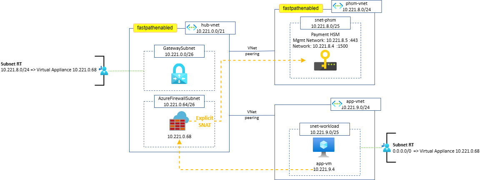

# Azure Payment HSM traffic inspection

The intent of this article is to explain how to inspect traffic to Azure Payment HSM and has since then led to the following Microsoft public documentation: [Azure Payment HSM traffic inspection](https://learn.microsoft.com/en-us/azure/payment-hsm/inspect-traffic) and [Fastpathenabled](https://learn.microsoft.com/en-us/azure/payment-hsm/fastpathenabled).

**Table of content**:
- [Azure Payment HSM](#azure-payment-hsm)
  * [Azure Payment HSM - Networking](#azure-payment-hsm---networking)
  * [FastPathEnabled feature flag & fastpathenabled VNet tag](https://github.com/cynthiatreger/phsm-traffic-inspection#fastpathenabled-feature-flag--fastpathenabled-vnet-tag)
  * [Azure Payment HSM - Networking limitations](#azure-payment-hsm---networking-limitations)
- [Solution #1 - Firewall with SNAT](https://github.com/cynthiatreger/phsm-traffic-inspection#solution-1---firewall-with-snat)
- [Solution #2 - Firewall & reverse proxy](https://github.com/cynthiatreger/phsm-traffic-inspection#solution-2---firewall--reverse-proxy)


# Azure Payment HSM

Payment Hardware Security Module (Payment HSM or PHSM) is a [bare-metal service](https://learn.microsoft.com/en-us/azure/payment-hsm/overview) providing cryptographic key operations for real-time and critical payment transactions in the Azure cloud. 

Payment HSM devices are a variation of Dedicated HSM devices with more advanced cryptographic modules and features: a Payment HSM never decrypts the PIN value in transit for example. 

The Azure Payment HSM solution uses hardware from [Thales](https://cpl.thalesgroup.com/encryption/hardware-security-modules/payment-hsms/payshield-10k) as a vendor. Customers have [full control and exclusive access](https://learn.microsoft.com/en-us/azure/payment-hsm/overview#customer-managed-hsm-in-azure) to the Payment HSM.

## Azure Payment HSM - Networking

When Payment HSM is deployed, it comes with a host network interface and a management network interface. There are several deployment scenarios:
1. [With host and management ports in same VNet](https://learn.microsoft.com/en-us/azure/payment-hsm/create-payment-hsm?tabs=azure-cli)
2. [With host and management ports in different VNets](https://learn.microsoft.com/en-us/azure/payment-hsm/create-different-vnet?tabs=azure-cli)
3. [With host and management port with IP addresses in different VNets](https://learn.microsoft.com/en-us/azure/payment-hsm/create-different-ip-addresses?tabs=azure-cli)

In all of the above scenarios, Payment HSM is a VNet-injected service in a delegated subnet: `hsmSubnet` and `managementHsmSubnet` must be delegated to `Microsoft.HardwareSecurityModules/dedicatedHSMs` service.

## FastPathEnabled feature flag & fastpathenabled VNet tag

In addition, the `FastPathEnabled` **feature** must be [registered and approved](https://learn.microsoft.com/en-us/azure/payment-hsm/register-payment-hsm-resource-providers?tabs=azure-cli#register-the-resource-providers-and-features) on all subscriptions that need access to Payment HSM.

A second step consists in enabling the `fastpathenabled` **tag** on the VNet hosting the Payment HSM delegated subnet and on every peered VNet requiring [connectivity to the Payment HSM devices](https://learn.microsoft.com/en-us/azure/payment-hsm/peer-vnets?tabs=azure-cli). The `fastpathenabled` tag isn't required on nondirectly peered VNets reaching the Payment HSM VNet via a Central hub for example. This operation must be done via CLI.

For the `fastpathenabled` VNet tag to be valid, the `FastPathEnabled` feature needs to be enabled on the subscription where that VNet is deployed: make sure to complete both steps to enable resources to connect to the Payment HSM devices. 

Adding the `FastPathEnabled` feature and enabling the `fastpathenabled` tag don't cause any downtime.

The public documentation related to these 2 settings is now available [here](https://learn.microsoft.com/en-us/azure/payment-hsm/fastpathenabled).
 
## Azure Payment HSM - Networking limitations

Payment HSM comes with some policy [restrictions](https://learn.microsoft.com/en-us/azure/payment-hsm/solution-design#constraints) on these subnets: **Network Security Groups (NSGs) and User-Defined Routes (UDRs) are currently not supported**.

> Note: PHSM is not compatible with vWAN topologies or cross region VNet peering, as listed in the [topology supported](https://learn.microsoft.com/en-us/azure/payment-hsm/solution-design#supported-topologies).

This article present two ways to inspect traffic destined to a Payment HSM:
* Solution #1 - Firewall with SNAT
* Solution #2 - Firewall & reverse proxy

# Solution #1 - Firewall with SNAT

This design is inspired by the [Dedicated HSM solution architecture](https://learn.microsoft.com/en-us/azure/dedicated-hsm/networking#solution-architecture).

**Concept**: The firewall **SNATs the client IP address** before forwarding traffic to the PHSM NIC, guaranteeing that the return traffic will automatically be directed back to the Firewall. Either an Azure Firewall or a 3rd party FW NVA can be used in this design.

**Architecture diagram**:



**Route tables required**:
1. On-Prem to PHSM: a Route Table containing a UDR for the Payment HSM VNet range and pointing to the central hub Firewall is applied to the GatewaySubnet.
2. Spoke VNet(s) to PHSM: a Route Table containing the usual default route pointing to the central hub Firewall is applied to the Spoke VNet(s) subnets. 

**Results**:
* UDRs not being supported on the PHSM subnet is addressed by the Firewall doing SNAT on the client IP: when forwarding traffic to PHSM, the return traffic will automatically be directed back to the Firewall.
* Filtering rules that cannot be enforced using NSGs on the PHSM subnet can be configured on the Firewall.
* Both Spoke traffic and On-Prem traffic to the PHSM environment are secured.

# Solution #2 - Firewall & reverse proxy

This design is a good option when performing SNAT on the Firewall is not approved by network security teams, requiring instead to keep the source and destination IPs unchanged for traffic crossing the Firewall.

**Concept**: This architecture leverages a reverse proxy, deployed in a dedicated subnet in the PHSM VNet directly or in a peered VNet. Instead of sending traffic to the PHSM devices, the destination is set to the reverse proxy IP, located in a subnet that does not have the restrictions of the PHSM delegated subnet: both NSGs and UDRs can be configured, and combined with a Firewall in the central hub.

**Architecture diagram**:


**Infrastructure required**:
A reverse proxy is required in this design.
Possible solutions:
* F5 (Azure Marketplace ; VM-based)
* NGINXaaS (Azure Marketplace ; PaaS fully managed)
* Reverse proxy Server using NGINX (VM-based)
* Reverse proxy Server using HAProxy (VM-based)

Example of reverse proxy Server using NGINX (VM-based) configuration:
```conf
# Nginx.conf  
stream { 
    server { 
        listen 1500; 
        proxy_pass 10.221.8.4:1500; 
    } 

    upstream phsm { 
        server 10.221.8.5:443; 
    } 

    server { 
        listen 443; 
        proxy_pass phsm; 
        proxy_next_upstream on; 
    } 
} 
```

**Route tables required**:
1. On-Prem to PHSM: a Route Table containing a UDR for the Payment HSM VNet range and pointing to the central hub Firewall is applied to the GatewaySubnet.
2. Spoke VNet(s) to PHSM: a Route Table containing the usual default route pointing to the central hub Firewall is applied to the Spoke VNet(s) subnets. 

> ***Gateway Route propagation*** must be disabled on the reverse proxy subnet, so that a 0/0 UDR is enough to force the return traffic via the Firewall.

**Results**:
* UDRs not being supported on the PHSM subnet can be configured on the reverse proxy subnet.
*  The reverse proxy SNATs the client IP: when forwarding traffic to PHSM, the return traffic will automatically be directed back to the reverse proxy.
* Filtering rules that cannot be enforced using NSGs on the PHSM subnet can be configured on the Firewall and/or on NSGs applied to the reverse proxy subnet.
* Both Spoke traffic and On-Prem traffic to the PHSM environment are secured.

